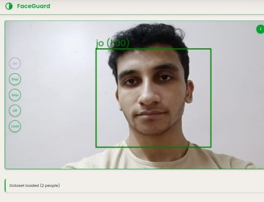

# FaceGuard - Intelligent Face Detection & Recognition System

 <!-- Replace with actual image path -->

**FaceGuard** is a web-based application that provides real-time face detection and recognition capabilities using TensorFlow.js and face-api.js. It is optimized for desktop and mobile devices with an interactive, touch-friendly UI.

## Table of Contents

- [Features](#features)
- [Demo](#demo)
- [Technologies Used](#technologies-used)
- [Installation](#installation)
- [Usage](#usage)
- [Project Structure](#project-structure)
- [Configuration](#configuration)
- [Troubleshooting](#troubleshooting)
- [Contributing](#contributing)
- [License](#license)
- [Acknowledgments](#acknowledgments)

---

## Features

- Real-time face detection using webcam
- Face recognition with custom datasets
- Mobile-optimized interface with touch support
- Visual overlays for face bounding boxes and confidence metrics
- Easy dataset management and model loading
- Responsive layout and customizable UI

---

## Demo

You can access the app [Here[(https://incredible-tiramisu-5a4156.netlify.app/)

To view a live demo, clone the repository and follow the [Installation](#installation) steps below.

---

## Technologies Used

- [face-api.js](https://github.com/justadudewhohacks/face-api.js) – Face detection and recognition
- [TensorFlow.js](https://www.tensorflow.org/js) – ML backend for browser
- HTML5 / CSS3 / JavaScript (ES6+)
- MediaDevices API for accessing webcam

---

## Installation

### 1. Clone the Repository

```bash
git clone https://github.com/your-username/FaceGuard.git
cd FaceGuard
```

### 2. Install Dependencies

If you are using Node.js or bundlers:

```bash
npm install
```

Otherwise, you can run directly from the browser using a simple server.

### 3. Download Face-api.js Models

Download the required models from [face-api.js models](https://github.com/justadudewhohacks/face-api.js-models) and place them in a `/models` directory in the project root.

Required models:

- `tiny_face_detector_model-weights_manifest.json`
- `face_landmark_68_model-weights_manifest.json`
- `face_recognition_model-weights_manifest.json`

### 4. Prepare Dataset

1. Create a `labels.json` file in the root directory.
2. Organize images in the following structure:

```
/labels
  /person1
    1.jpg
    2.jpg
  /person2
    1.jpg
    ...
```

---

## Usage

### 1. Start Local Server

You can use any static server to run the app locally:

```bash
npx http-server
```

Or use VSCode’s Live Server extension.

### 2. Interface Controls

- **Camera**: Toggle webcam on/off
- **Detect**: Start/stop face detection
- **Recognize**: Start face recognition using dataset
- **Load Dataset**: Load your own labeled face images
- **Stop**: Turn off all processes

### 3. Mobile Optimization

- Fully responsive layout
- Touch-friendly UI controls
- Mobile-safe interactions
- Prevents default pinch-to-zoom

---

## Project Structure

```
FaceGuard/
│
├── index.html
├── app.js
├── style.css
├── /models               # Pretrained face-api.js models
├── /labels               # Face images per person
├── labels.json           # Dataset labels config
├── screenshot.png        # Project preview
└── README.md
```

---

## Configuration

You can customize the appearance using CSS variables in `style.css`:

```css
:root {
  --accent: #00a82e;
  --button-size: 50px;
  --container-max-width: 1200px;
  --shadow: 0 4px 6px rgba(0, 0, 0, 0.1);
}
```

---

## Troubleshooting

**Common Issues:**

- **Camera access denied**  
  Ensure the app is running on HTTPS or localhost.

- **Models not loading**  
  Verify the `/models` folder exists and contains the correct files.

- **Face detection or recognition not working**  
  Check browser console for errors and confirm dataset structure is valid.

- **Mobile issues**  
  Make sure `playsinline` is enabled on video tag to avoid fullscreen takeover.

**Browser Compatibility:**

- Works best on Chrome, Firefox, or Safari (latest versions)

---

## Contributing

Contributions are welcome! Follow these steps:

1. Fork the repository
2. Create a new branch
   ```bash
   git checkout -b feature/YourFeatureName
   ```
3. Commit your changes
   ```bash
   git commit -m "Add YourFeatureName"
   ```
4. Push to the branch
   ```bash
   git push origin feature/YourFeatureName
   ```
5. Open a pull request

---

## License

This project is licensed under the [MIT License](LICENSE).

---

## Acknowledgments

- Face detection powered by [face-api.js](https://github.com/justadudewhohacks/face-api.js)
- Inspired by modern intelligent surveillance systems
- UI enhancements inspired by responsive and mobile-first design principles
- Loading animation by [SpinKit](https://tobiasahlin.com/spinkit/)

---

Would you like me to generate the `LICENSE`, `package.json`, or a `labels.json` sample file for you as well?
